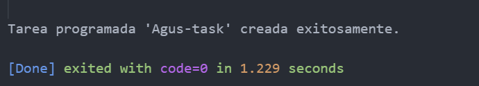

# TaskScheduler.PowerShell
This repository contains PowerShell scripts that create and manage scheduled tasks using Task Scheduler. It provides examples of task automation through PowerShell code.

<div align="center">
  
</div>

### Code run 🚀
```
powershell 1-task.ps1
```

### Result 📈


